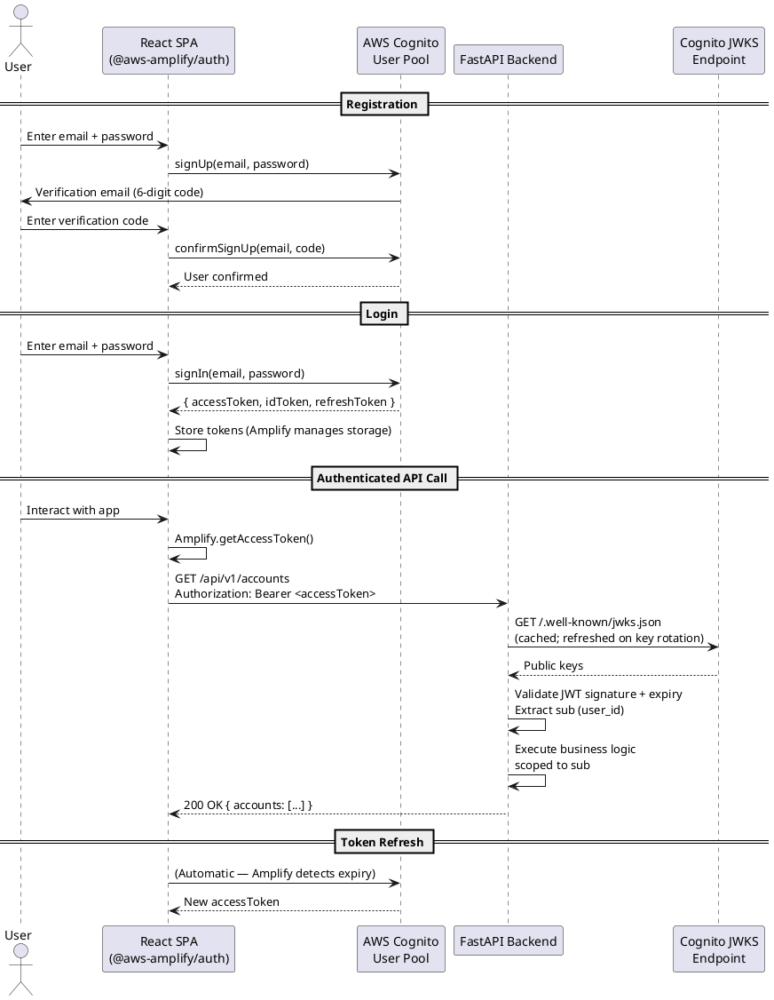
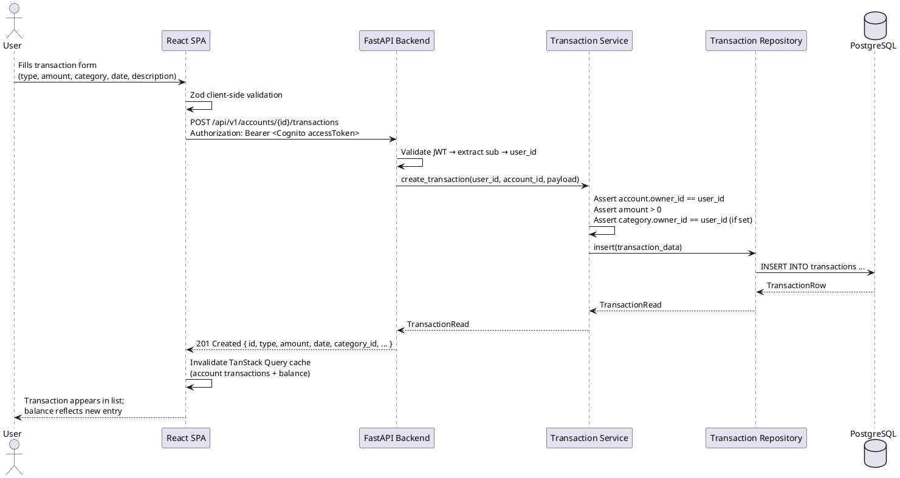
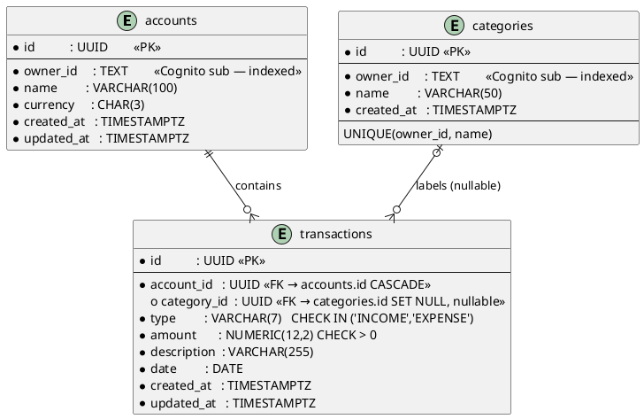
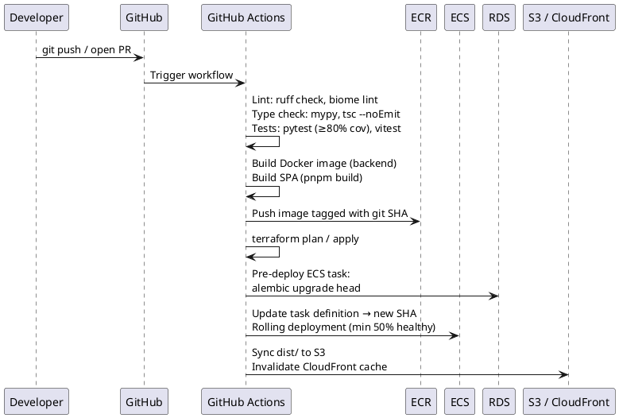

# High-Level Design — Personal Finance Manager

## 1. Introduction

### Purpose
This document defines the high-level design for the Personal Finance Manager (PFM) — 
a web application that helps individuals track their daily income and expenses across 
one or more personal ledger accounts, with a goal of understanding their running balance and spending patterns over time.

### Scope

**In scope (MVP):**
- User registration, email verification, and authentication via AWS Cognito (email + password)
- Personal financial accounts (ledger-style — not bank accounts)
- Transaction recording: INCOME or EXPENSE, with user-defined categories and a transaction date
- Date-range filtered transaction views with pagination
- Running balance per account (derived from transactions)
- User-defined category management
- Deployment on AWS (ECS Fargate + RDS + S3/CloudFront + Cognito) via Terraform

**Out of scope (MVP):**
- Social login (OAuth2 providers) — Cognito supports this post-MVP with zero backend change
- Multi-currency conversion
- Recurring / scheduled transactions
- Budget limits and alerts
- Shared accounts / multi-user collaboration
- Mobile applications
- CSV / PDF export
- Bank account integrations (Plaid, etc.)

### Definitions and Acronyms
| Term        | Definition                                                                               |
|-------------|------------------------------------------------------------------------------------------|
| Account     | A personal financial ledger owned by a user (e.g. "Personal Finances", "Business")       |
| Transaction | A single INCOME or EXPENSE event recorded against an account                             |
| Balance     | Derived value: `SUM(INCOME amounts) − SUM(EXPENSE amounts)` for an account               |
| Category    | A user-defined label applied to a transaction (e.g. Salary, Groceries, Utilities)        |
| Cognito     | AWS Cognito — managed identity service handling registration, login, and token lifecycle |
| User Pool   | A Cognito directory of users with configurable password and MFA policies                 |
| `sub`       | Cognito's stable UUID identifier for a user, present in every issued JWT                 |
| JWT         | JSON Web Token — issued by Cognito; validated by the backend                             |
| ECS         | Amazon Elastic Container Service                                                         |
| RDS         | Amazon Relational Database Service                                                       |
| ALB         | Application Load Balancer                                                                |
| CDN         | Content Delivery Network (CloudFront)                                                    |
| ADR         | Architecture Decision Record                                                             |

### References
- `CLAUDE.md` — coding conventions, tech stack, layer rules
- AWS Cognito Developer Guide — https://docs.aws.amazon.com/cognito
- FastAPI documentation — https://fastapi.tiangolo.com
- Terraform AWS provider documentation

---

## 2. System Overview

### System Description
The Personal Finance Manager is a browser-based single-page application (SPA) backed by a REST API.
Authentication and user management are fully delegated to AWS Cognito. 
The application never handles raw passwords or issues tokens.
After authenticating via Cognito, the SPA receives a JWT (Cognito access token) and includes it in every API call.
The FastAPI backend validates the token against Cognito's public JWKS endpoint,
extracts the user's stable `sub` identifier, and uses it to scope all data queries.
Users manage personal financial accounts (ledgers) and log income/expense transactions against them,
optionally tagging each transaction with a user-defined category.

### Design Goals
| Goal            | Approach                                                                                                                                                                                                                                               |
|-----------------|--------------------------------------------------------------------------------------------------------------------------------------------------------------------------------------------------------------------------------------------------------|
| Type safety     | Strict mypy (backend), strict TypeScript (frontend)                                                                                                                                                                                                    |
| Maintainability | Thin routers, fat services; layered architecture                                                                                                                                                                                                       |
| Scalability     | Stateless API; horizontally scalable ECS Fargate tasks                                                                                                                                                                                                 |
| Security        | Cognito-managed auth; no passwords in our code; HTTPS everywhere                                                                                                                                                                                       |
| Testability     | ≥80% backend coverage; every service method has a unit test,<br/> and every API has integration tests where database interaction are mocked but everything else works same as production </br> the integration test cases must use a mock http server. |
| Extensibility   | Domain-driven folder structure; Cognito supports MFA/social login post-MVP                                                                                                                                                                             |

### Architecture Summary
A monolithic FastAPI backend (stateless REST API) with a decoupled React SPA frontend. Authentication is fully delegated to AWS Cognito (no auth code in the application). PostgreSQL is the single source of truth for financial data. The SPA is served globally from S3 + CloudFront; the API is served via ALB → ECS Fargate.

### System Context Diagram

```plantuml
@startuml
!include https://raw.githubusercontent.com/plantuml-stdlib/C4-PlantUML/master/C4_Context.puml

Person(user, "Individual User", "Tracks personal income and expenses\nvia a web browser")

System(pfm, "Personal Finance Manager", "Web application for recording and\nanalysing personal financial transactions")

System_Ext(cognito, "AWS Cognito", "Managed identity service.\nHandles registration, login,\nemail verification, and JWT issuance.")

System_Ext(aws, "AWS Cloud", "Hosts all infrastructure:\ncompute, storage, database, CDN")

Rel(user, pfm, "Uses the app", "HTTPS")
Rel(pfm, cognito, "Delegates auth — registration,\nlogin, token refresh", "HTTPS / Cognito SDK")
Rel(pfm, aws, "Deployed on", "Terraform-managed")

@enduml
```

---

## 3. Architectural Design

### Container Architecture Diagram

```plantuml
@startuml
!include https://raw.githubusercontent.com/plantuml-stdlib/C4-PlantUML/master/C4_Container.puml

Person(user, "User", "Web browser")

System_Boundary(pfm, "Personal Finance Manager") {
    Container(spa, "React SPA", "TypeScript · Vite · TanStack Query · shadcn/ui · Amplify Auth",
              "Single-page application.\nHandles auth flows via Cognito SDK.\nCalls REST API with Cognito JWT.")
    Container(api, "FastAPI Backend", "Python 3.12 · FastAPI · SQLModel · uvicorn",
              "Stateless REST API.\nValidates Cognito JWTs.\nManages accounts, transactions, categories.")
    ContainerDb(db, "PostgreSQL 16", "AWS RDS (Multi-AZ)",
                "Persistent financial data:\naccounts, transactions, categories.")
}

System_Ext(cognito, "AWS Cognito", "User Pool + App Client.\nRegistration, login, email verification,\naccess + refresh + ID tokens.")
System_Ext(cf, "CloudFront + S3", "CDN — serves the compiled SPA")
System_Ext(alb, "Application Load Balancer", "TLS termination · health checks · traffic routing")

Rel(user, cf, "HTTPS", "Browser")
Rel(cf, spa, "Serves compiled SPA", "S3 origin")
Rel(spa, cognito, "Register / login / refresh token", "HTTPS / Cognito SDK")
Rel(spa, alb, "REST calls /api/v1/...\nAuthorization: Bearer <Cognito access token>", "HTTPS")
Rel(alb, api, "Routes to container", "HTTP (private VPC)")
Rel(api, cognito, "Fetch JWKS (public keys)\nto validate incoming JWTs", "HTTPS (cached)")
Rel(api, db, "Async SQL", "asyncpg / SQLAlchemy 2")

@enduml
```

### Component Breakdown
| Component           | Technology                                                                | Responsibilities                                                                                               |
|---------------------|---------------------------------------------------------------------------|----------------------------------------------------------------------------------------------------------------|
| React SPA           | TypeScript, Vite, TanStack Query, Zustand, shadcn/ui, `@aws-amplify/auth` | Renders all UI; handles Cognito auth flows (sign-up, sign-in, token refresh); calls REST API with Bearer token |
| FastAPI Backend     | Python 3.12, FastAPI, uvicorn                                             | Validates Cognito JWTs; delegates business logic to services; returns Pydantic schemas                         |
| Account Service     | SQLModel, PostgreSQL                                                      | Creates and deletes ledger accounts; computes derived balance                                                  |
| Transaction Service | SQLModel, PostgreSQL                                                      | Full CRUD for transactions; date-range queries; category assignment                                            |
| Category Service    | SQLModel, PostgreSQL                                                      | User-defined category CRUD; handles FK nullification on delete                                                 |
| AWS Cognito         | User Pool, App Client                                                     | Manages user identities, passwords, email verification, token issuance and rotation                            |
| PostgreSQL (RDS)    | PostgreSQL 16, Multi-AZ                                                   | Durable storage; enforces referential integrity and check constraints                                          |
| S3 + CloudFront     | AWS                                                                       | Hosts and globally distributes the compiled SPA                                                                |
| ALB                 | AWS                                                                       | TLS termination; health checks; routes traffic to ECS Fargate tasks                                            |
| ECS Fargate         | AWS                                                                       | Runs the FastAPI Docker container; auto-scales on CPU                                                          |

### Technology Stack
See `CLAUDE.md §2` for version-pinned details. Auth-related overrides noted below.

| Layer          | Key Technologies                                                                                                |
|----------------|-----------------------------------------------------------------------------------------------------------------|
| Backend        | Python 3.12, FastAPI ≥0.115, SQLModel, Alembic, structlog, `python-jose[cryptography]` (Cognito JWT validation) |
| Frontend       | TypeScript ≥5.5, React, Vite ≥6, TanStack Query v5, Zustand v5, shadcn/ui, Tailwind v4, `@aws-amplify/auth`     |
| Auth           | AWS Cognito User Pool — replaces PyJWT + passlib[bcrypt] from CLAUDE.md                                         |
| Database       | PostgreSQL 16 on RDS                                                                                            |
| Infrastructure | AWS (Cognito, ECS Fargate, RDS, S3, CloudFront, ALB, Secrets Manager, ECR), Terraform                           |
| CI/CD          | GitHub Actions                                                                                                  |

> **Note:** `PyJWT` and `passlib[bcrypt]` listed in `CLAUDE.md §2` are superseded by Cognito. The backend uses `python-jose` only to validate incoming Cognito-issued JWTs against Cognito's JWKS endpoint. No password hashing or token signing happens in the application.

### Authentication Flow



### Data Flow — User Logs a Transaction



---

## 4. Detailed Design

### 4.1 Authentication — Cognito Integration

**Responsibilities:** Cognito owns the full auth lifecycle. The backend's only responsibility is validating the Cognito-issued JWT on every protected request.


**Cognito User Pool Configuration:**

| Setting                      | Value                                                      |
|------------------------------|------------------------------------------------------------|
| Sign-in identifier           | Email (unique)                                             |
| Password policy              | Min 8 chars, uppercase + lowercase + number                |
| Email verification           | Required (Cognito sends OTP on registration)               |
| Token expiry — access token  | 1 hour                                                     |
| Token expiry — refresh token | 30 days                                                    |
| App client                   | Public client (no client secret — SPA cannot keep secrets) |

**Frontend (SPA) — `@aws-amplify/auth`:**
```typescript
// lib/auth.ts — Amplify configuration
import { Amplify } from "aws-amplify";
Amplify.configure({
  Auth: {
    Cognito: {
      userPoolId: import.meta.env.VITE_COGNITO_USER_POOL_ID,
      userPoolClientId: import.meta.env.VITE_COGNITO_APP_CLIENT_ID,
    },
  },
});

// Usage in components
import { signUp, signIn, signOut, fetchAuthSession } from "aws-amplify/auth";
```

Amplify handles token storage, automatic refresh, and expiry detection. No manual token management needed.

**Backend — JWT Validation:**
```python
# core/auth.py
from jose import jwt, JWTError
import httpx

JWKS_URL = f"https://cognito-idp.{AWS_REGION}.amazonaws.com/{USER_POOL_ID}/.well-known/jwks.json"

async def get_current_user_id(token: str = Depends(oauth2_scheme)) -> str:
    """Validates Cognito access token; returns sub (stable user UUID)."""
    try:
        keys = await _get_cached_jwks()
        claims = jwt.decode(token, keys, algorithms=["RS256"],
                            audience=APP_CLIENT_ID)
        return claims["sub"]   # Cognito sub — our user_id
    except JWTError:
        raise AppError(401, "token-invalid", "Unauthorized", "Invalid or expired token")
```

JWKS are cached in memory (refreshed only on `kid` mismatch — key rotation is rare).

**User identity in the database:**
The Cognito `sub` (a UUID string) is used directly as `owner_id` across all tables. There is **no separate `users` table** — Cognito is the authoritative user store. On first API call after registration, no provisioning step is needed; the `sub` is simply used as the foreign key.

> **ADR-001 — Resolved:** Cognito issues access tokens (1h) + refresh tokens (30 days). Token refresh is handled automatically by `@aws-amplify/auth`. No refresh endpoint needed in our API.
>
> **ADR-003 — Resolved:** Amplify Auth stores tokens in `localStorage` by default (with `CookieStorage` available as an option). For MVP, `localStorage` is acceptable given Cognito tokens are short-lived (1h) and we control CSP headers to mitigate XSS risk.

---

### 4.2 Account Module

**Responsibilities:** Create and delete personal ledger accounts for the authenticated user. Return the derived balance per account.

**API Endpoints:**

| Method | Path                            | Auth   | Request Body    | Response            |
|--------|---------------------------------|--------|-----------------|---------------------|
| GET    | `/api/v1/accounts`              | Bearer | —               | `list[AccountRead]` |
| POST   | `/api/v1/accounts`              | Bearer | `AccountCreate` | `AccountRead` (201) |
| DELETE | `/api/v1/accounts/{account_id}` | Bearer | —               | 204 No Content      |

**Error Handling:**
- Account not found or belongs to another user → 404 (`account-not-found`)

**Key Data Structures:**
```python
class AccountCreate(BaseModel):
    name: str      # max 100 chars

class AccountRead(BaseModel):
    id: UUID
    name: str
    currency: str          # ISO 4217, default "USD" — ADR-002
    balance: Decimal       # derived: SUM(INCOME) − SUM(EXPENSE)
    created_at: datetime
```

**Logic:**
- Balance is **computed on every read** (no stored column) to avoid sync drift. At MVP scale a single aggregation query is fast enough.
- DELETE: DB-level `ON DELETE CASCADE` removes all child transactions automatically.

---

### 4.3 Transaction Module
**Responsibilities:** Record, update, and delete transactions. Support date-range filtering and offset pagination.

**API Endpoints:**

| Method | Path                                          | Auth   | QueryBody                        | Response                |
|--------|-----------------------------------------------|--------|----------------------------------|-------------------------|
| GET    | `/api/v1/accounts/{id}/transactions`          | Bearer | `?start_date&end_date&page&size` | `Page[TransactionRead]` |
| POST   | `/api/v1/accounts/{id}/transactions`          | Bearer | `TransactionCreate`              | `TransactionRead` (201) |
| PUT    | `/api/v1/accounts/{id}/transactions/{txn_id}` | Bearer | `TransactionUpdate`              | `TransactionRead`       |
| DELETE | `/api/v1/accounts/{id}/transactions/{txn_id}` | Bearer | —                                | 204 No Content          |


**Error Handling:**
- Account or transaction not found / wrong owner → 404 (`transaction-not-found`)
- `amount ≤ 0` → 422 (`invalid-amount`)
- `category_id` not owned by the user → 422 (`invalid-category`)

**Key Data Structures:**
```python
class TransactionType(str, Enum):
    INCOME = "INCOME"
    EXPENSE = "EXPENSE"

class TransactionCreate(BaseModel):
    type: TransactionType
    amount: Decimal            # always positive; enforced in service
    description: str           # max 255 chars
    date: date                 # transaction date (user-supplied, not server time)
    category_id: UUID | None = None

class TransactionUpdate(BaseModel):
    type: TransactionType | None = None
    amount: Decimal | None = None
    description: str | None = None
    date: date | None = None
    category_id: UUID | None = None

class TransactionRead(BaseModel):
    id: UUID
    account_id: UUID
    type: TransactionType
    amount: Decimal
    description: str
    date: date
    category_id: UUID | None
    created_at: datetime
    updated_at: datetime

class Page(BaseModel, Generic[T]):
    items: list[T]
    total: int
    page: int
    size: int
```

**Logic:**
- Date filter: `WHERE account_id = :id AND date BETWEEN :start AND :end` using the composite index.
- Pagination: offset-based for MVP (`LIMIT size OFFSET (page-1)*size`).

---

### 4.4 Category Module

**Responsibilities:** User-defined category CRUD. Categories are scoped to the owning user and usable across all of their accounts.

**API Endpoints:**

| Method | Path                               | Auth   | Request Body     | Response             |
|--------|------------------------------------|--------|------------------|----------------------|
| GET    | `/api/v1/categories`               | Bearer | —                | `list[CategoryRead]` |
| POST   | `/api/v1/categories`               | Bearer | `CategoryCreate` | `CategoryRead` (201) |
| DELETE | `/api/v1/categories/{category_id}` | Bearer | —                | 204 No Content       |

**Error Handling:**
- Duplicate name for same user → 409 (`category-already-exists`)
- Category not found / wrong owner → 404 (`category-not-found`)

**Logic:**
- Deleting a category sets `category_id = NULL` on all referencing transactions (DB-level `ON DELETE SET NULL`).

**Key Data Structures:**
```python
class CategoryCreate(BaseModel):
    name: str    # max 50 chars; unique per user (enforced at DB + service)

class CategoryRead(BaseModel):
    id: UUID
    name: str
    created_at: datetime
```

---

## 5. Database Design

### Design Note — No `users` Table
Because Cognito is the authoritative user store, the application does not maintain a `users` table. Every row that belongs to a user carries `owner_id TEXT` — the Cognito `sub` UUID string extracted from the JWT. This eliminates any user-sync complexity (no Lambda triggers, no lazy-create logic) while maintaining strict data isolation.

### ER Diagram



### Table Definitions

**`accounts`**

| Column     | Type         | Constraints               |
|------------|--------------|---------------------------|
| id         | UUID         | PK, `gen_random_uuid()`   |
| owner_id   | TEXT         | NOT NULL (Cognito sub)    |
| name       | VARCHAR(100) | NOT NULL                  |
| currency   | CHAR(3)      | NOT NULL, default `'USD'` |
| created_at | TIMESTAMPTZ  | NOT NULL, `now()`         |
| updated_at | TIMESTAMPTZ  | NOT NULL, `now()`         |

**`categories`**

| Column     | Type        | Constraints            |
|------------|-------------|------------------------|
| id         | UUID        | PK                     |
| owner_id   | TEXT        | NOT NULL (Cognito sub) |
| name       | VARCHAR(50) | NOT NULL               |
| created_at | TIMESTAMPTZ | NOT NULL               |
|            |             | UNIQUE(owner_id, name) |

**`transactions`**

| Column      | Type          | Constraints                                     |
|-------------|---------------|-------------------------------------------------|
| id          | UUID          | PK                                              |
| account_id  | UUID          | FK → accounts.id ON DELETE CASCADE              |
| category_id | UUID          | FK → categories.id ON DELETE SET NULL, nullable |
| type        | VARCHAR(7)    | NOT NULL, CHECK IN ('INCOME','EXPENSE')         |
| amount      | NUMERIC(12,2) | NOT NULL, CHECK amount > 0                      |
| description | VARCHAR(255)  | NOT NULL                                        |
| date        | DATE          | NOT NULL                                        |
| created_at  | TIMESTAMPTZ   | NOT NULL                                        |
| updated_at  | TIMESTAMPTZ   | NOT NULL                                        |

### Indexes
```sql
-- Ownership lookups (all primary query entry point)
CREATE INDEX ix_accounts_owner       ON accounts(owner_id);
CREATE INDEX ix_categories_owner     ON categories(owner_id);

-- Primary transaction query: account filtered by date (descending)
CREATE INDEX ix_transactions_account_date
    ON transactions(account_id, date DESC);

-- Category filter
CREATE INDEX ix_transactions_account_category
    ON transactions(account_id, category_id);
```

### Relationships Summary
| Relationship              | Cardinality    | Cascade            |
|---------------------------|----------------|--------------------|
| Cognito sub → accounts    | 1:N            | Logical (no DB FK) |
| Cognito sub → categories  | 1:N            | Logical (no DB FK) |
| accounts → transactions   | 1:N            | DELETE CASCADE     |
| categories → transactions | 1:N (nullable) | SET NULL           |

### Migration Strategy
- All schema changes use Alembic `--autogenerate`, committed alongside application code.
- No raw SQL in application code — all queries via SQLAlchemy ORM.
- In production, migrations run as a one-off ECS task (`alembic upgrade head`) executed as a pre-deploy step in CI/CD before the new service version is rolled out.

---

## 6. External Interfaces

### User Interface — Key Screens
| Screen                 | Purpose                                                                                       |
|------------------------|-----------------------------------------------------------------------------------------------|
| Register               | Amplify Auth UI (or custom form): email + password. Cognito sends OTP for email verification. |
| Verify Email           | Enter OTP received by email. Handled by Amplify `confirmSignUp`.                              |
| Login                  | Email + password form. Amplify `signIn` → Cognito issues tokens.                              |
| Dashboard              | Grid of accounts showing name and computed balance. "New Account" button.                     |
| Account Detail         | Paginated transaction list. Date-range picker. INCOME/EXPENSE totals and running balance.     |
| Add / Edit Transaction | Modal: type toggle (INCOME / EXPENSE), amount, description, date picker, category dropdown.   |
| Category Management    | List of user's categories. Inline "Add category" form. Delete button per category.            |

### External APIs
| Service               | Purpose                                                                            |
|-----------------------|------------------------------------------------------------------------------------|
| AWS Cognito           | User Pool — registration, login, token issuance, email verification, token refresh |
| Cognito JWKS endpoint | Backend fetches public keys to validate JWTs (cached in memory)                    |

### Network Protocols
| Leg                        | Protocol            | Notes                         |
|----------------------------|---------------------|-------------------------------|
| Browser → CloudFront / ALB | HTTPS (TLS 1.2+)    | Certificate via AWS ACM       |
| SPA → Cognito              | HTTPS               | `@aws-amplify/auth` SDK calls |
| ALB → ECS Fargate          | HTTP (internal VPC) | TLS terminated at ALB         |
| ECS → RDS                  | TCP with SSL        | asyncpg `ssl=require`         |
| ECS → Cognito JWKS         | HTTPS               | Public endpoint, cached       |

---

## 7. Security Considerations

### Authentication
- **Fully managed by AWS Cognito.** The application never sees, stores, or hashes passwords.
- Cognito issues RS256-signed JWTs (access token 1h, refresh token 30 days).
- Token refresh is handled automatically by `@aws-amplify/auth` on the frontend.
- Email verification is enforced by Cognito before a user can sign in.

### Authorization
- Every API endpoint requires a valid Cognito access token (`Authorization: Bearer <token>`).
- The `get_current_user_id` FastAPI dependency validates the JWT and returns the Cognito `sub`.
- All DB queries are scoped to `owner_id = sub` — users can never read or mutate another user's data.
- `owner_id` is **never** accepted from the request body; it always comes from the validated JWT.

### Data Protection
| Concern          | Control                                                                          |
|------------------|----------------------------------------------------------------------------------|
| Passwords        | Owned and stored by Cognito — never touch our application or database            |
| JWT signing keys | RS256 key pair managed by Cognito; our backend validates signatures, never signs |
| DB credentials   | AWS Secrets Manager; injected at ECS task startup via IAM role                   |
| Transport        | HTTPS enforced at CloudFront and ALB; HTTP only inside the private VPC           |
| Logs             | structlog — amounts and IDs logged; passwords and raw tokens never logged        |

### Compliance
No HIPAA or GDPR-specific requirements for MVP. Personal financial data is sensitive; apply responsible defaults: no third-party analytics SDKs, no data sharing with external services. Cognito's data residency is configured to the same AWS region as all other infrastructure.

### Threat Model
| Threat              | Mitigation                                                                                                 |
|---------------------|------------------------------------------------------------------------------------------------------------|
| Credential stuffing | Cognito's built-in account lockout and CAPTCHA (configurable)                                              |
| Token forgery       | Cognito RS256; backend validates against JWKS public keys                                                  |
| Stolen access token | 1h expiry limits blast radius; refresh token stored by Amplify                                             |
| SQL injection       | SQLAlchemy ORM parameterised queries; no raw SQL                                                           |
| XSS                 | React DOM escaping; strict CSP headers via CloudFront response policies                                    |
| IDOR                | All DB queries include `owner_id = sub` from JWT; account ownership verified before any transaction access |
| Secrets leakage     | No secrets in code or Docker images; Secrets Manager with IAM-role-only access                             |

---

## 8. Performance and Scalability

### Expected Load (MVP)
- ~100 concurrent users; ~1,000 transactions/day
- P99 API response time target: < 200 ms
- No real-time requirements; REST polling is acceptable

### Caching Strategy
| Layer            | Strategy                                                               |
|------------------|------------------------------------------------------------------------|
| Client (SPA)     | TanStack Query stale-while-revalidate; cache invalidation on mutations |
| CDN (SPA assets) | CloudFront long TTL on immutable hashed bundles                        |
| Cognito JWKS     | In-memory cache in FastAPI process; refreshed only on `kid` mismatch   |
| Server-side data | None for MVP — DB queries are fast at this scale                       |

### Database Optimisation
- Composite index on `(account_id, date DESC)` covers the primary transaction query pattern.
- Balance computed via a single aggregation: `SELECT SUM(CASE WHEN type='INCOME' THEN amount ELSE -amount END) FROM transactions WHERE account_id = :id`.
- Offset pagination for MVP; keyset (cursor) pagination can be adopted when transaction counts grow large.

### Scaling Strategy
| Concern              | Approach                                                             |
|----------------------|----------------------------------------------------------------------|
| API horizontal scale | ECS Fargate auto-scaling by CPU (target 60%); API is fully stateless |
| Auth scale           | Cognito scales automatically; no action needed                       |
| Database read scale  | RDS read replica for heavy reporting queries (post-MVP)              |
| Database HA          | RDS Multi-AZ (automatic standby failover)                            |
| Frontend             | CloudFront edge caching — scales to any traffic level                |

---

## 9. Deployment Architecture

### Environments
| Environment  | Purpose                   | Notes                                                                                           |
|--------------|---------------------------|-------------------------------------------------------------------------------------------------|
| `local`      | Development               | Docker Compose: FastAPI + PostgreSQL 16; local Cognito mock via `moto` or `cognito-local`       |
| `staging`    | Pre-production validation | AWS — same Terraform, smaller sizes (`db.t3.micro`, 1 Fargate task, separate Cognito User Pool) |
| `production` | Live                      | AWS — RDS Multi-AZ, ECS autoscaling (1–4 tasks), production Cognito User Pool                   |

### CI/CD Pipeline



### AWS Infrastructure Diagram

```plantuml
@startuml
!include https://raw.githubusercontent.com/plantuml-stdlib/C4-PlantUML/master/C4_Deployment.puml

Deployment_Node(aws, "AWS — us-east-1", "Cloud Provider") {

    Deployment_Node(cognito_node, "AWS Cognito") {
        Container(cognito, "User Pool + App Client", "Cognito",
                  "Registration, login, email verification.\nIssues RS256 JWTs.\nManages refresh tokens.")
    }

    Deployment_Node(edge, "Edge / CDN") {
        Container(cf, "CloudFront Distribution", "CDN",
                  "Serves SPA from S3.\nProxies /api/* to ALB.\nTLS via ACM.")
        Container(s3, "S3 Bucket", "Static Assets",
                  "Compiled React SPA.\nNot publicly accessible — OAC only.")
    }

    Deployment_Node(vpc, "VPC (us-east-1)") {

        Deployment_Node(pub_subnets, "Public Subnets (AZ-a, AZ-b)") {
            Container(alb, "Application Load Balancer", "AWS ALB",
                      "TLS termination (ACM cert).\nHealth checks.\nRoutes /api/* to ECS target group.")
        }

        Deployment_Node(priv_subnets, "Private Subnets (AZ-a, AZ-b)") {
            Container(ecs_a, "ECS Fargate Task (AZ-a)", "Docker · Python 3.12",
                      "FastAPI + uvicorn.\nValidates Cognito JWTs.\nAuto-scales 1–4 tasks.")
            Container(ecs_b, "ECS Fargate Task (AZ-b)", "Docker · Python 3.12",
                      "Scale-out task.")
            ContainerDb(rds_primary, "RDS PostgreSQL 16 — Primary", "db.t3.small",
                        "Financial data store.")
            ContainerDb(rds_standby, "RDS PostgreSQL 16 — Standby", "Multi-AZ",
                        "Automatic failover.")
        }

        Deployment_Node(support, "Supporting Services") {
            Container(secrets, "Secrets Manager", "AWS",
                      "DB credentials.\nIAM-role-only access.")
            Container(ecr, "ECR", "Container Registry",
                      "Versioned backend Docker images.")
        }
    }
}

Rel(cf, s3, "Origin (OAC)", "HTTPS")
Rel(cf, alb, "Proxy /api/*", "HTTPS")
Rel(alb, ecs_a, "HTTP", "Port 8000")
Rel(alb, ecs_b, "HTTP", "Port 8000")
Rel(ecs_a, rds_primary, "asyncpg SSL", "Port 5432")
Rel(ecs_b, rds_primary, "asyncpg SSL", "Port 5432")
Rel(rds_primary, rds_standby, "Sync replication", "Internal")
Rel(ecs_a, cognito, "Fetch JWKS (cached)", "HTTPS")
Rel(ecs_a, secrets, "Read at startup", "HTTPS / IAM")
Rel(ecr, ecs_a, "Image pull", "HTTPS")

@enduml
```

### Terraform Module Structure
```
infra/
├── main.tf
├── variables.tf
├── outputs.tf
├── modules/
│   ├── cognito/         # User Pool, App Client, password policy
│   ├── networking/      # VPC, subnets (public/private), NAT gateway, SGs
│   ├── compute/         # ECS cluster, Fargate task definition, service, autoscaling
│   ├── database/        # RDS PostgreSQL, subnet group, parameter group, SG
│   ├── cdn/             # CloudFront distribution, S3 bucket, Origin Access Control
│   ├── alb/             # ALB, target group, HTTPS listener, ACM certificate
│   └── secrets/         # Secrets Manager secrets (DB credentials)
└── environments/
    ├── staging/          # staging.tfvars
    └── production/       # production.tfvars
```

---

## 10. Testing Strategy

### Backend
| Layer        | Tools                                       | Target                                                                             |
|--------------|---------------------------------------------|------------------------------------------------------------------------------------|
| Unit         | pytest, pytest-asyncio, MagicMock           | Every service method; repositories mocked; ≥80% line coverage                      |
| Integration  | pytest, httpx AsyncClient, in-memory SQLite | Full HTTP → DB round-trip; Cognito JWT validation mocked with known RS256 key pair |
| Lint + types | ruff check, mypy (strict)                   | Zero errors before any merge                                                       |

**Cognito JWT mocking in tests:** Integration tests generate a real RS256 key pair locally and configure the JWT validator to use it instead of the Cognito JWKS endpoint. This allows testing the full auth middleware without network calls.

### Frontend
| Layer        | Tools                         | Target                                                                                                                          |
|--------------|-------------------------------|---------------------------------------------------------------------------------------------------------------------------------|
| Component    | Vitest, React Testing Library | Key user interactions, form validation, error rendering; Amplify Auth mocked                                                    |
| E2E          | Playwright                    | Critical flows against staging Cognito User Pool: Register → Verify → Login → Create account → Add transaction → Verify balance |
| Lint + types | Biome, tsc --noEmit           | Zero errors before any merge                                                                                                    |

### Quality Gates (CI enforced)
- Backend coverage `--cov-fail-under=80`
- No `any` in TypeScript; no `# type: ignore` without an explanation comment
- All CI checks must pass before merge to `main`

---

## 11. Appendices

### ADR-001 — JWT Token Refresh Strategy
**Status:** Resolved by Cognito adoption.

Cognito issues short-lived access tokens (1h) and long-lived refresh tokens (30 days). `@aws-amplify/auth` automatically refreshes the access token before expiry. No refresh endpoint is needed in our API.

---

### ADR-002 — Multi-Currency Support
**Status:** Decided — deferred post-MVP.

The `accounts` table includes a `currency` column (default `USD`) for future use. All MVP code assumes a single display currency per account. No conversion logic is implemented.

---

### ADR-003 — JWT Client-Side Storage
**Status:** Resolved by Cognito adoption.

`@aws-amplify/auth` manages token storage. For MVP, the default (`localStorage`) is used — access tokens are short-lived (1h) and XSS risk is mitigated by strict CSP headers. If stricter posture is required post-MVP, Amplify's `CookieStorage` option can be configured to use `httpOnly` cookies without application code changes.

---

### Glossary
| Term        | Definition                                                                            |
|-------------|---------------------------------------------------------------------------------------|
| Account     | User's personal financial ledger (not a bank account)                                 |
| Balance     | `SUM(INCOME amounts) − SUM(EXPENSE amounts)` for an account; computed on read         |
| Transaction | A single financial event (INCOME or EXPENSE) recorded against an account              |
| Category    | A user-created label for grouping transactions (e.g. Salary, Groceries)               |
| `sub`       | Cognito's stable UUID string identifier for a user; used as `owner_id` in all tables  |
| ADR         | Architecture Decision Record — a documented design decision and its rationale         |
| MVP         | Minimum Viable Product                                                                |
| OAC         | Origin Access Control — CloudFront mechanism to restrict direct S3 bucket access      |
| JWKS        | JSON Web Key Set — Cognito's public key endpoint used by the backend to validate JWTs |

---

### Change History
| Version | Date       | Author           | Changes                                                                                                                                              |
|---------|------------|------------------|------------------------------------------------------------------------------------------------------------------------------------------------------|
| 0.1     | 2026-05-24 | Kalpa Senanayake | Initial draft — custom JWT auth                                                                                                                      |
| 0.2     | 2026-05-24 | Kalpa Senanayake | Replaced custom auth with AWS Cognito; resolved ADR-001 and ADR-003; removed `users` table; updated DB schema, security, and infrastructure sections |
| 0.3     | 2026-05-25 | Kalpa Senanayake | Removed PATCH /transactions/{id}/category — category re-assignment handled via PUT; added account name uniqueness per user (UNIQUE(owner_id, name))  |
