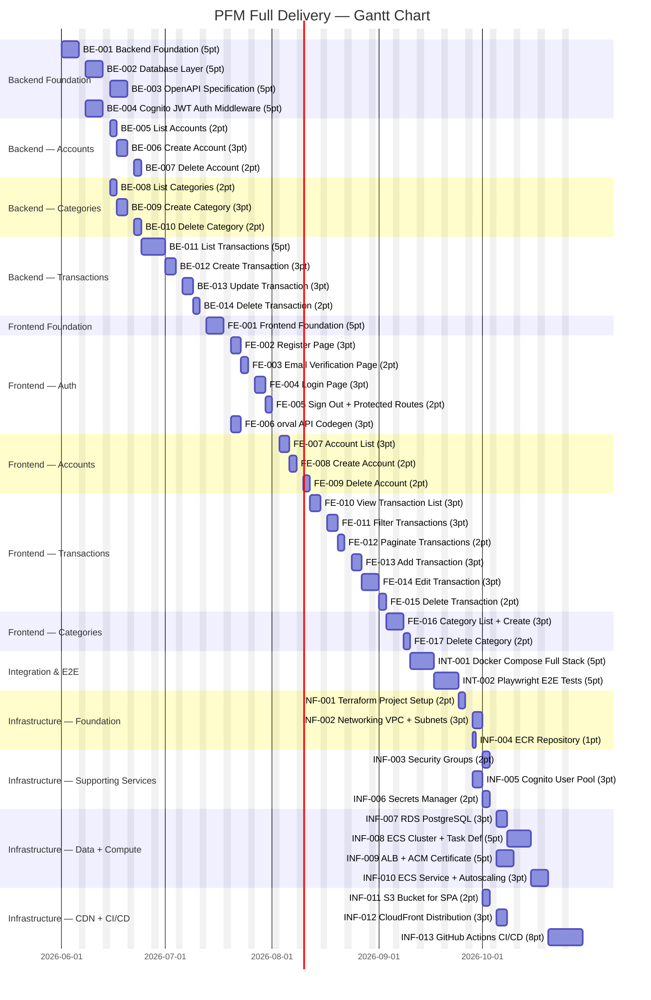

# Gantt Chart — Personal Finance Manager Delivery

Assumes a single engineer, 1 story point = 1 working day, weekends excluded.
Start date: 2026-06-01. Estimated completion: 2026-11-12 (~24 weeks).

Parallel tracks within each phase are shown as concurrent bars.

## Summary

| Phase | Stories | Points | Approx Duration |
|-------|---------|--------|-----------------|
| Backend | 14 | 47 | ~10 weeks |
| Frontend | 17 | 46 | ~9.5 weeks |
| Integration | 2 | 10 | ~2 weeks |
| Infrastructure | 13 | 42 | ~8.5 weeks (with parallel tracks) |
| **Total** | **46** | **145** | **~24 weeks** |

> Parallel tracks within Backend (Accounts + Categories) and Infrastructure (Networking, Cognito, Secrets, S3 in parallel) compress the calendar timeline. With two engineers the total delivery could be reduced to approximately 16–18 weeks.
