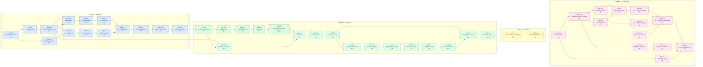

# Requirement Diagram — Personal Finance Manager

Shows interdependencies between all backlog stories. Arrows indicate "must be completed before".

```mermaid
graph LR
    subgraph BACKEND["Phase 1 — Backend"]
        BE001["BE-001\nBackend Foundation\n5pt"]
        BE002["BE-002\nDatabase Layer\n5pt"]
        BE003["BE-003\nOpenAPI Specification\n5pt"]
        BE004["BE-004\nCognito JWT Auth\n5pt"]
        BE005["BE-005\nList Accounts\n2pt"]
        BE006["BE-006\nCreate Account\n3pt"]
        BE007["BE-007\nDelete Account\n2pt"]
        BE008["BE-008\nList Categories\n2pt"]
        BE009["BE-009\nCreate Category\n3pt"]
        BE010["BE-010\nDelete Category\n2pt"]
        BE011["BE-011\nList Transactions\n5pt"]
        BE012["BE-012\nCreate Transaction\n3pt"]
        BE013["BE-013\nUpdate Transaction\n3pt"]
        BE014["BE-014\nDelete Transaction\n2pt"]
    end

    subgraph FRONTEND["Phase 2 — Frontend"]
        FE001["FE-001\nFrontend Foundation\n5pt"]
        FE002["FE-002\nRegister Page\n3pt"]
        FE003["FE-003\nEmail Verification\n2pt"]
        FE004["FE-004\nLogin Page\n3pt"]
        FE005["FE-005\nSign Out + Protected Routes\n2pt"]
        FE006["FE-006\norval API Codegen\n3pt"]
        FE007["FE-007\nAccount List\n3pt"]
        FE008["FE-008\nCreate Account\n2pt"]
        FE009["FE-009\nDelete Account\n2pt"]
        FE010["FE-010\nView Transaction List\n3pt"]
        FE011["FE-011\nFilter Transactions\n3pt"]
        FE012["FE-012\nPaginate Transactions\n2pt"]
        FE013["FE-013\nAdd Transaction\n3pt"]
        FE014["FE-014\nEdit Transaction\n3pt"]
        FE015["FE-015\nDelete Transaction\n2pt"]
        FE016["FE-016\nCategory List + Create\n3pt"]
        FE017["FE-017\nDelete Category\n2pt"]
    end

    subgraph INTEGRATION["Phase 3 — Integration"]
        INT001["INT-001\nDocker Compose Full Stack\n5pt"]
        INT002["INT-002\nPlaywright E2E Tests\n5pt"]
    end

    subgraph INFRA["Phase 4 — Infrastructure"]
        INF001["INF-001\nTerraform Setup\n2pt"]
        INF002["INF-002\nNetworking VPC + Subnets\n3pt"]
        INF003["INF-003\nSecurity Groups\n2pt"]
        INF004["INF-004\nECR Repository\n1pt"]
        INF005["INF-005\nCognito User Pool\n3pt"]
        INF006["INF-006\nSecrets Manager\n2pt"]
        INF007["INF-007\nRDS PostgreSQL\n3pt"]
        INF008["INF-008\nECS Cluster + Task Def\n5pt"]
        INF009["INF-009\nALB + ACM Certificate\n5pt"]
        INF010["INF-010\nECS Service + Autoscaling\n3pt"]
        INF011["INF-011\nS3 Bucket for SPA\n2pt"]
        INF012["INF-012\nCloudFront Distribution\n3pt"]
        INF013["INF-013\nGitHub Actions CI/CD\n8pt"]
    end

    %% Backend dependencies
    BE001 --> BE002
    BE002 --> BE003
    BE001 --> BE004
    BE003 --> BE005
    BE004 --> BE005
    BE003 --> BE008
    BE004 --> BE008
    BE005 --> BE006
    BE006 --> BE007
    BE008 --> BE009
    BE009 --> BE010
    BE007 --> BE011
    BE010 --> BE011
    BE011 --> BE012
    BE012 --> BE013
    BE013 --> BE014

    %% Backend to Frontend handoff
    BE014 --> FE001
    BE003 --> FE006

    %% Frontend dependencies
    FE001 --> FE002
    FE001 --> FE006
    FE002 --> FE003
    FE003 --> FE004
    FE004 --> FE005
    FE005 --> FE007
    FE006 --> FE007
    FE007 --> FE008
    FE008 --> FE009
    FE009 --> FE010
    FE010 --> FE011
    FE011 --> FE012
    FE012 --> FE013
    FE013 --> FE014
    FE014 --> FE015
    FE009 --> FE016
    FE015 --> FE016
    FE016 --> FE017

    %% Frontend to Integration handoff
    FE017 --> INT001

    %% Integration dependencies
    INT001 --> INT002

    %% Integration to Infrastructure handoff
    INT002 --> INF001

    %% Infrastructure dependencies
    INF001 --> INF002
    INF001 --> INF004
    INF001 --> INF005
    INF002 --> INF003
    INF002 --> INF006
    INF002 --> INF011
    INF003 --> INF007
    INF003 --> INF009
    INF006 --> INF007
    INF007 --> INF008
    INF008 --> INF010
    INF009 --> INF010
    INF005 --> INF010
    INF011 --> INF012
    INF010 --> INF013
    INF012 --> INF013
    INF004 --> INF013

    %% Styles
    classDef backend fill:#dbeafe,stroke:#2563eb,color:#1e3a8a
    classDef frontend fill:#dcfce7,stroke:#16a34a,color:#14532d
    classDef integration fill:#fef9c3,stroke:#ca8a04,color:#713f12
    classDef infra fill:#fce7f3,stroke:#db2777,color:#831843

    class BE001,BE002,BE003,BE004,BE005,BE006,BE007,BE008,BE009,BE010,BE011,BE012,BE013,BE014 backend
    class FE001,FE002,FE003,FE004,FE005,FE006,FE007,FE008,FE009,FE010,FE011,FE012,FE013,FE014,FE015,FE016,FE017 frontend
    class INT001,INT002 integration
    class INF001,INF002,INF003,INF004,INF005,INF006,INF007,INF008,INF009,INF010,INF011,INF012,INF013 infra
```
