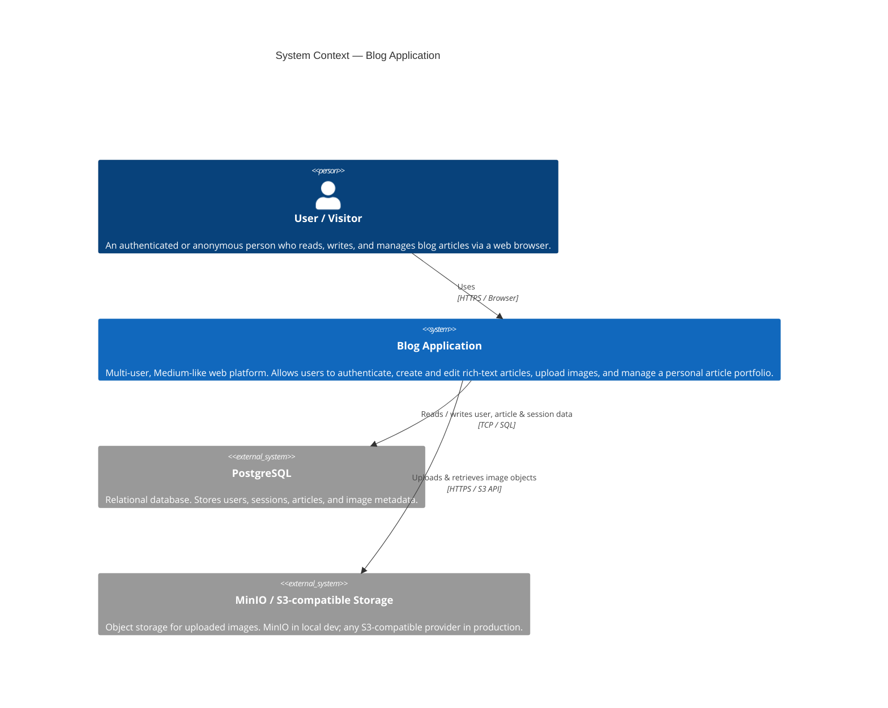
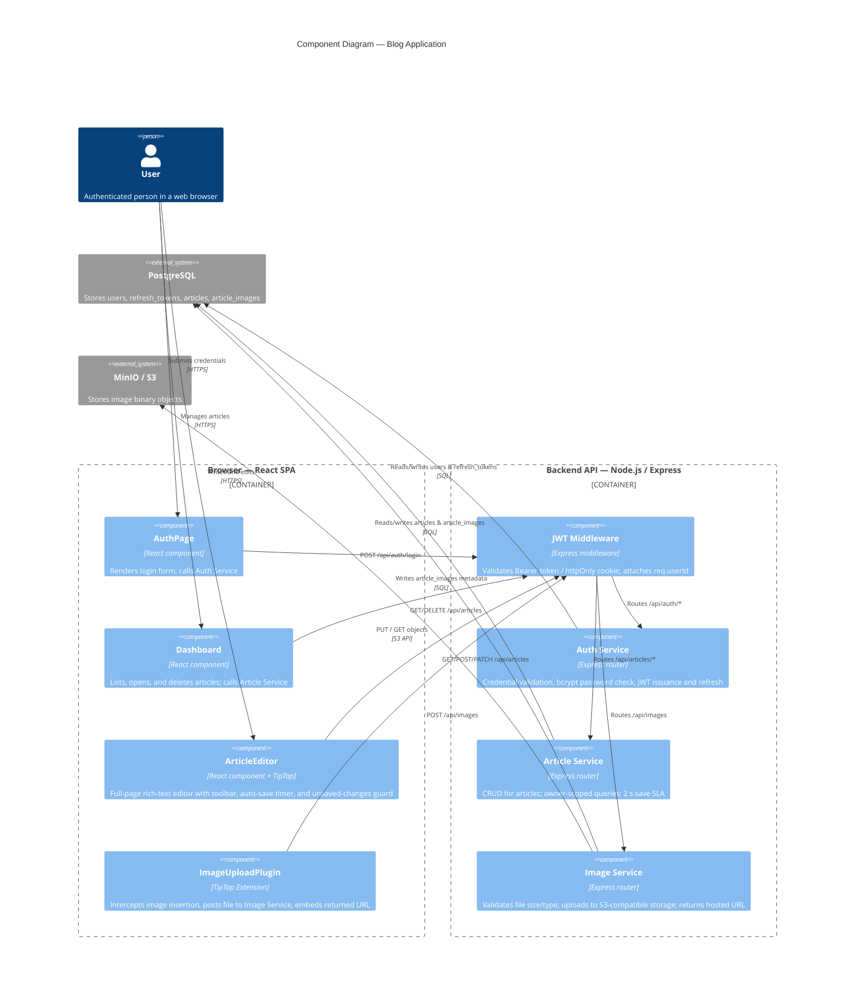
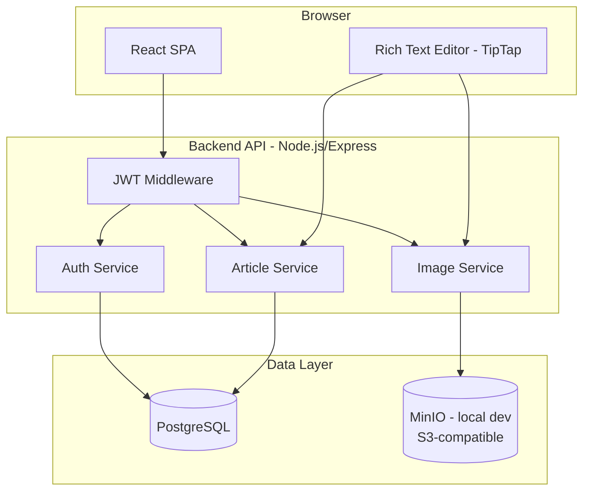
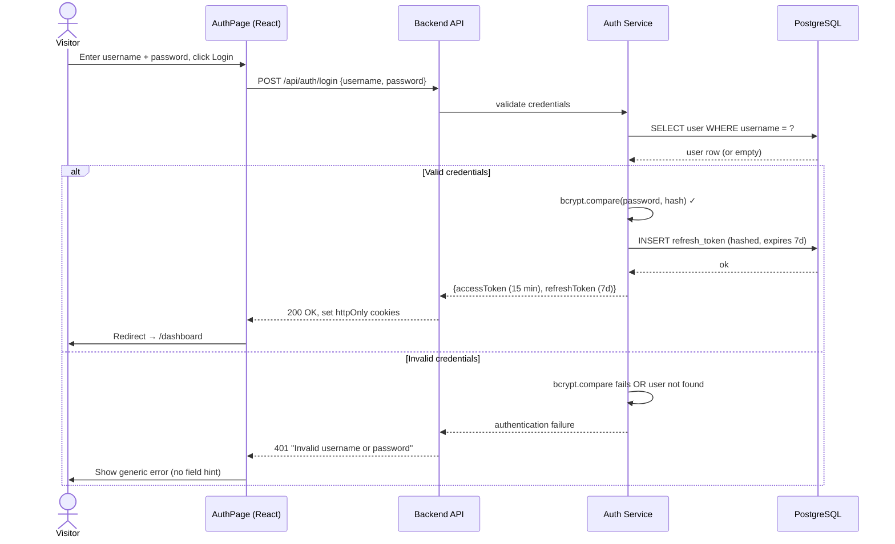
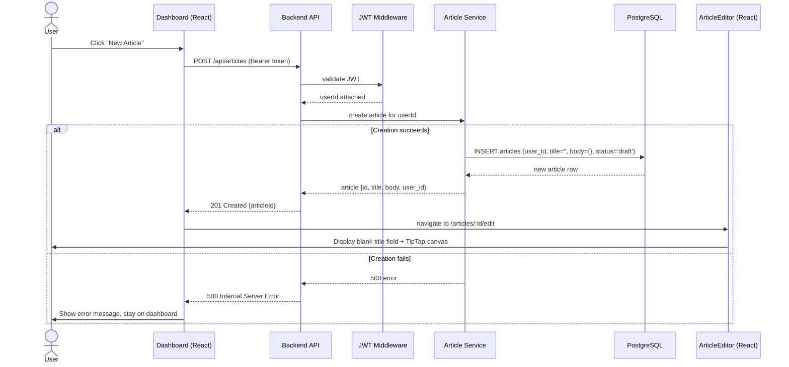
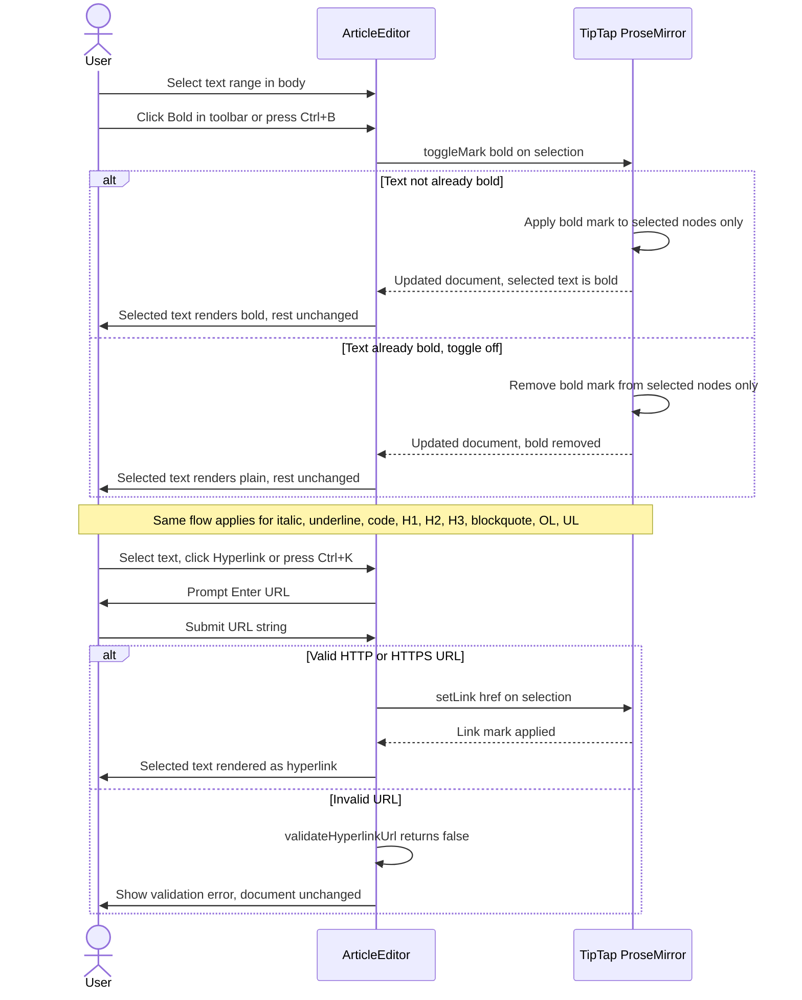
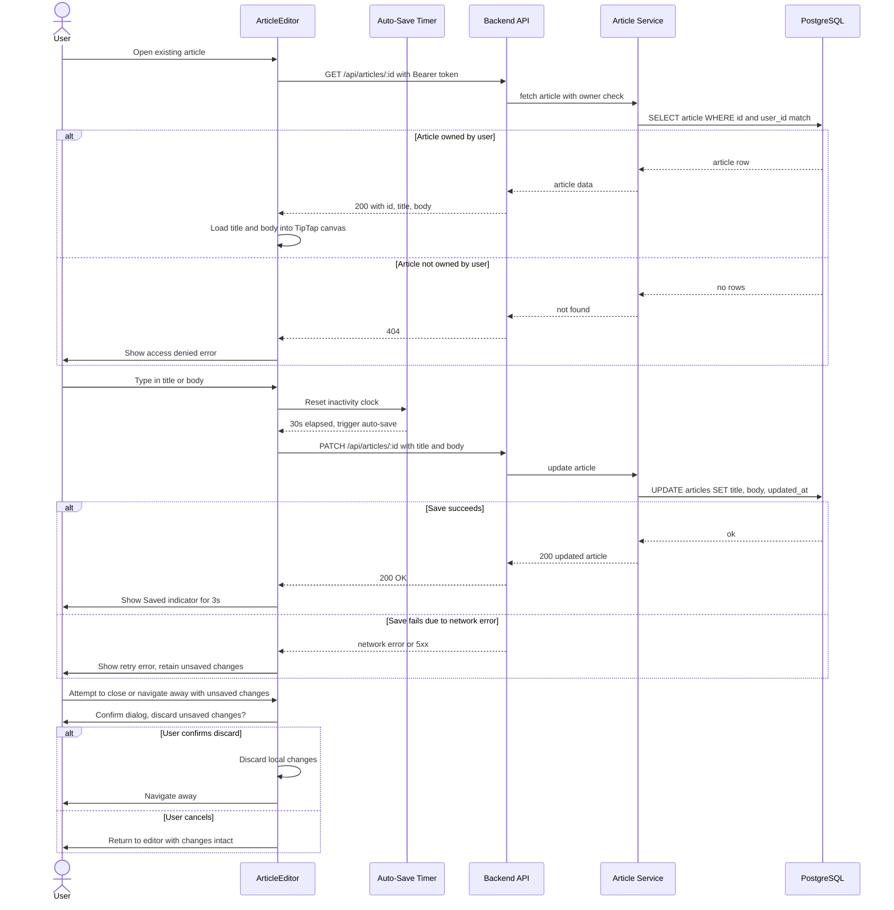
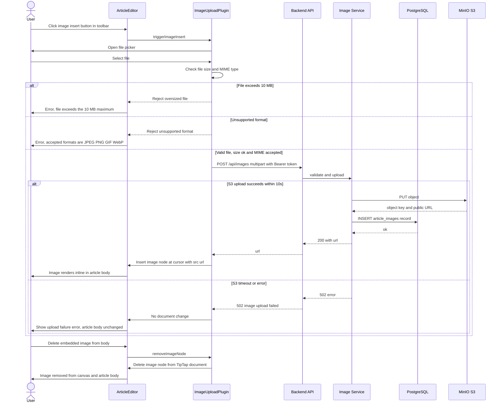
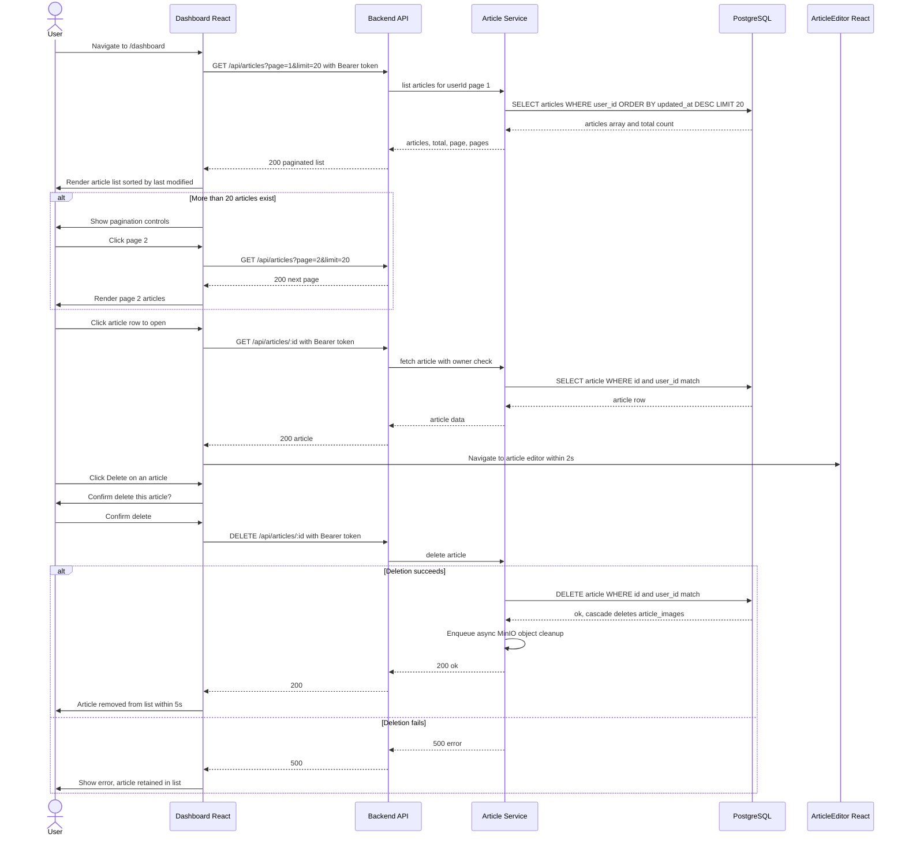
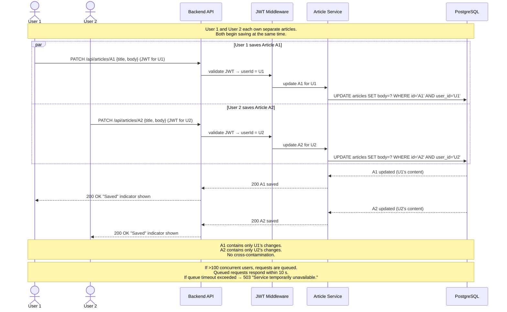

# Design Document — Blog Application

## Overview

The blog application is a multi-user, Medium-like web platform that lets authenticated users create, edit, and manage articles through a rich-text editing experience. The system supports:

- User authentication with session management
- A WYSIWYG editor with inline and block-level formatting
- Image uploads embedded directly inside article bodies
- Auto-save and manual save for articles
- A paginated per-user article dashboard
- Concurrent access by 100+ simultaneous users

The architecture follows a three-tier web application model: a React single-page application (SPA) frontend, a Node.js/Express REST API backend, and a PostgreSQL relational database. Image storage uses an S3-compatible object storage service — **MinIO** in local/dev (run via Docker Compose) and a real S3-compatible provider in production. The entire stack is containerised and orchestrated with Docker Compose so it runs from a single command on any developer machine. A Makefile exposes `dev`, `build`, and `test` targets as the primary developer interface. The backend enforces authentication via JWT-based sessions, and all user data is strictly scoped to the authenticated owner.

---

## Architecture

### System Context Diagram (C4 Level 1)

The blog application as a black box, its primary user, and the external systems it depends on.



### Component Diagram (C4 Level 2 / 3)

Internal components of the Blog Application and their relationships.



### High-Level Flow Diagram



### Key Architectural Decisions

- **SPA + REST API separation**: Frontend and backend are independently deployable. The SPA communicates exclusively through versioned REST endpoints.
- **JWT sessions**: Stateless authentication via short-lived JWTs (15 min access token + 7-day refresh token) stored in `httpOnly` cookies. This avoids shared server-side session state, which aids horizontal scaling.
- **TipTap (ProseMirror-based) editor**: Open-source, extensible rich-text editor with built-in support for all required formatting features and a well-tested keyboard shortcut system.
- **PostgreSQL**: Relational integrity between users, articles, and image metadata. JSONB column for article body content (stored as TipTap's JSON document format), allowing rich queries while preserving document structure.
- **MinIO for local object storage**: MinIO is an S3-compatible object storage server that runs as a Docker container. It exposes the same AWS S3 API, so the Image Service code does not change between local dev and production — only the endpoint URL and credentials differ (via environment variables). This eliminates any dependency on a real AWS account to develop and test locally.
- **Docker Compose for local orchestration**: All services (frontend dev server, backend API, PostgreSQL, MinIO) are defined in `docker-compose.yml`. A single `make dev` spins up the full stack.
- **Makefile as developer interface**: Three primary targets — `make dev` (start all services), `make build` (production build), `make test` (run full test suite). Keeps the developer workflow consistent and discoverable.
- **Horizontal scaling via stateless API**: Because sessions are JWT-based and article state is in PostgreSQL, multiple API instances can run behind a load balancer without sticky sessions.

---

## Diagrams

Sequence diagrams covering all seven user stories in the requirements.

---

### Req 1 — User Authentication (Login Flow)



---

### Req 2 — Article Creation



---

### Req 3 — Rich Text Editing (Formatting Flow)



---

### Req 4 — Article Editing and Saving (including Auto-Save)



---

### Req 5 — Image Management (Upload Flow including Error Cases)



---

### Req 6 — Multiple Articles / Dashboard (List, Open, Delete)



---

### Req 7 — Concurrent Multi-User Support (Two Users Saving Simultaneously)



---

## Local Development Setup

### Docker Compose Services

```yaml
# docker-compose.yml (summary)
services:
  frontend:      # React dev server (Vite), port 3000
  api:           # Node.js/Express, port 4000, hot-reload via nodemon
  db:            # PostgreSQL 16, port 5432, data persisted in named volume
  minio:         # MinIO object storage, API port 9000, console port 9001
  minio-init:    # One-shot container: creates the 'blog-images' bucket on first run
```

- The `api` service connects to `db` and `minio` over the internal Docker network using service-name hostnames (`db:5432`, `minio:9000`).
- MinIO credentials in dev are fixed to `minioadmin / minioadmin` via environment variables.
- The `STORAGE_ENDPOINT` environment variable on the `api` service controls whether to point at MinIO (local) or a real S3 endpoint (production). No code change is required to switch.
- Database migrations run automatically on `api` startup using a migration tool (e.g., `node-postgres-migrate` or `Knex` migrations).

### Makefile Targets

| Target | Description |
|--------|-------------|
| `make dev` | `docker compose up --build` — starts all services with hot-reload |
| `make build` | Builds production Docker images for `frontend` and `api` |
| `make test` | Runs the full test suite (unit + property-based) inside the `api` and `frontend` containers |
| `make test-integration` | Brings up the Compose stack and runs integration tests against live services |
| `make down` | `docker compose down` — stops and removes containers |
| `make logs` | Tails logs from all running Compose services |

### Environment Variables

The Image Service is configured entirely through environment variables, enabling zero-code switching between local MinIO and production S3:

| Variable | Local (dev) | Production |
|----------|------------|------------|
| `STORAGE_ENDPOINT` | `http://minio:9000` | `https://s3.amazonaws.com` |
| `STORAGE_ACCESS_KEY` | `minioadmin` | AWS access key |
| `STORAGE_SECRET_KEY` | `minioadmin` | AWS secret key |
| `STORAGE_BUCKET` | `blog-images` | `<prod-bucket-name>` |
| `STORAGE_REGION` | `us-east-1` | AWS region |
| `STORAGE_PUBLIC_URL` | `http://localhost:9000/blog-images` | CDN / S3 public URL |

The `STORAGE_PUBLIC_URL` variable is used to construct the hosted image URLs returned to the frontend. In local dev, images are served directly from MinIO on `localhost:9000`.

---

## Components and Interfaces

### Frontend Components

#### `AuthPage`
- Renders username/password form
- On submit calls `POST /api/auth/login`
- On success stores JWT and redirects to `/dashboard`
- On failure displays error without revealing which field was wrong

#### `Dashboard`
- Fetches `GET /api/articles?page=N&limit=20` for the authenticated user
- Renders paginated article list sorted by `updated_at` descending
- Provides "New Article", "Edit", and "Delete" actions per row

#### `ArticleEditor`
- Hosts the TipTap editor instance
- Title field: plain-text `<input>` bound to article title, max 200 chars
- Body field: TipTap editor canvas
- Toolbar: bold, italic, underline, code, H1/H2/H3, blockquote, OL, UL, hyperlink, image insert
- Auto-save timer: triggers `PATCH /api/articles/:id` every 30 s while editing activity detected
- Unsaved-changes guard: beforeunload + React Router navigation block
- "Saved" indicator: non-overlapping toast that auto-dismisses after 3 s

#### `ImageUploadPlugin` (TipTap extension)
- Intercepts image insertion
- Posts file to `POST /api/images`
- On success inserts an image node at cursor with the returned URL
- On error (size/format/timeout) surfaces error message without modifying document

### Backend Services

#### Auth Service (`/api/auth`)

| Method | Path | Description |
|--------|------|-------------|
| POST | `/api/auth/login` | Validate credentials, issue JWT access + refresh tokens |
| POST | `/api/auth/refresh` | Exchange valid refresh token for new access token |
| POST | `/api/auth/logout` | Invalidate refresh token, clear cookies |

- Password hashed with bcrypt (cost factor 12)
- Returns identical error messages for wrong username or wrong password (no field enumeration)
- JWT payload: `{ sub: userId, iat, exp }`

#### Article Service (`/api/articles`)

| Method | Path | Description |
|--------|------|-------------|
| GET | `/api/articles` | List user's articles, paginated (`page`, `limit`) |
| POST | `/api/articles` | Create new blank article |
| GET | `/api/articles/:id` | Fetch single article (owner-only) |
| PATCH | `/api/articles/:id` | Update title and/or body (owner-only) |
| DELETE | `/api/articles/:id` | Delete article and associated images (owner-only) |

- All endpoints require valid JWT via `JWT Middleware`
- Owner check: `WHERE id = :id AND user_id = :userId`
- Save SLA: PATCH must complete within 2 s; guarded by a DB write timeout
- Delete cascades to `article_images` table; MinIO/S3 object deletion is async (enqueued)

#### Image Service (`/api/images`)

| Method | Path | Description |
|--------|------|-------------|
| POST | `/api/images` | Upload image, return hosted URL |

- Accepts multipart/form-data
- Validates: file size ≤ 10 MB, MIME type in `{image/jpeg, image/png, image/gif, image/webp}`
- On validation failure: 400 with descriptive message
- On S3 upload success: returns `{ url: "https://..." }`
- On S3 timeout/error: returns 502 with error payload
- Stores image metadata in `article_images` after successful upload
- Uses the S3-compatible AWS SDK client; `STORAGE_ENDPOINT` points to MinIO in local dev and real S3 in production

#### JWT Middleware
- Validates `Authorization: Bearer <token>` header or `access_token` httpOnly cookie
- On invalid/expired token: 401
- Attaches `req.userId` for downstream handlers

---

## Data Models

### PostgreSQL Schema

```sql
-- Users
CREATE TABLE users (
    id          UUID PRIMARY KEY DEFAULT gen_random_uuid(),
    username    VARCHAR(64) UNIQUE NOT NULL,
    password_hash VARCHAR(255) NOT NULL,     -- bcrypt hash
    created_at  TIMESTAMPTZ NOT NULL DEFAULT now()
);

-- Refresh tokens (for session management)
CREATE TABLE refresh_tokens (
    id          UUID PRIMARY KEY DEFAULT gen_random_uuid(),
    user_id     UUID NOT NULL REFERENCES users(id) ON DELETE CASCADE,
    token_hash  VARCHAR(255) NOT NULL,       -- SHA-256 of the raw refresh token
    expires_at  TIMESTAMPTZ NOT NULL,
    created_at  TIMESTAMPTZ NOT NULL DEFAULT now()
);

-- Articles
CREATE TABLE articles (
    id          UUID PRIMARY KEY DEFAULT gen_random_uuid(),
    user_id     UUID NOT NULL REFERENCES users(id) ON DELETE CASCADE,
    title       VARCHAR(200) NOT NULL DEFAULT '',
    body        JSONB NOT NULL DEFAULT '{}', -- TipTap JSON document
    status      VARCHAR(20) NOT NULL DEFAULT 'draft' CHECK (status IN ('draft', 'published')),
    created_at  TIMESTAMPTZ NOT NULL DEFAULT now(),
    updated_at  TIMESTAMPTZ NOT NULL DEFAULT now()
);

CREATE INDEX idx_articles_user_updated ON articles(user_id, updated_at DESC);

-- Image metadata
CREATE TABLE article_images (
    id          UUID PRIMARY KEY DEFAULT gen_random_uuid(),
    article_id  UUID REFERENCES articles(id) ON DELETE SET NULL,
    user_id     UUID NOT NULL REFERENCES users(id) ON DELETE CASCADE,
    storage_key VARCHAR(512) NOT NULL,       -- S3 object key
    url         TEXT NOT NULL,               -- Public / pre-signed URL
    size_bytes  BIGINT NOT NULL,
    mime_type   VARCHAR(64) NOT NULL,
    uploaded_at TIMESTAMPTZ NOT NULL DEFAULT now()
);
```

### TipTap Document Format (JSONB body)

Article bodies are stored as TipTap's native JSON document tree, e.g.:

```json
{
  "type": "doc",
  "content": [
    { "type": "heading", "attrs": { "level": 1 }, "content": [{ "type": "text", "text": "Hello" }] },
    { "type": "paragraph", "content": [
      { "type": "text", "marks": [{ "type": "bold" }], "text": "Bold text" }
    ]}
  ]
}
```

Storing as JSONB preserves the full document structure without requiring a custom serialization format, and allows future server-side content queries.

### Session / JWT Claims

```json
{
  "sub": "<userId UUID>",
  "iat": 1700000000,
  "exp": 1700000900
}
```

Access token TTL: 15 minutes. Refresh token TTL: 7 days, stored hashed in `refresh_tokens`.

---

## Correctness Properties

*A property is a characteristic or behavior that should hold true across all valid executions of a system — essentially, a formal statement about what the system should do. Properties serve as the bridge between human-readable specifications and machine-verifiable correctness guarantees.*

---

### Property 1: Authentication Error Indistinguishability

*For any* combination of (username, password) that fails authentication — whether the username is unknown, the password is wrong, or both — the error message returned by the Auth_Service SHALL be identical and SHALL NOT reference which specific field caused the failure.

**Validates: Requirements 1.2**

---

### Property 2: Active Session Grants Uninterrupted Access

*For any* freshly issued, non-expired JWT, every protected API endpoint SHALL respond with a non-401 status code when that token is presented, without requiring the user to re-authenticate.

**Validates: Requirements 1.3**

---

### Property 3: Article Creation Invariants

*For any* authenticated user, creating a new article SHALL produce an article whose title is empty, whose body is empty, and whose `user_id` equals exactly the creating user's ID.

**Validates: Requirements 2.1, 2.5**

---

### Property 4: Multiple Articles Per User

*For any* authenticated user and any integer N > 1, creating N distinct articles for that user SHALL result in all N articles being retrievable from that user's article list.

**Validates: Requirements 2.6**

---

### Property 5: Formatting Scoped to Selection

*For any* TipTap document and *for any* selection range within it, applying an inline or block format SHALL modify only the nodes within the selection and leave all text outside the selection unchanged.

**Validates: Requirements 3.3**

---

### Property 6: Formatting Toggle (Round-Trip)

*For any* text node in a TipTap document that has a format F applied, applying format F a second time SHALL remove format F from that text, returning the node to its pre-formatted state.

**Validates: Requirements 3.5**

---

### Property 7: Hyperlink URL Validation

*For any* string that is not a valid HTTP or HTTPS URL (i.e., does not match `^https?://`), attempting to apply it as a hyperlink in the Rich_Text_Editor SHALL be rejected with a validation error, and no link SHALL be applied to the document.

**Validates: Requirements 3.7**

---

### Property 8: Article Save/Load Round-Trip

*For any* article with an arbitrary title (≤ 200 characters) and arbitrary body content, saving the article via PATCH and then loading it via GET SHALL return a title and body identical to what was saved.

**Validates: Requirements 4.1**

---

### Property 9: Article Ownership Access Control

*For any* two distinct users U1 and U2 where U1 is the owner of article A, any request by U2 to read or modify article A SHALL be denied (HTTP 403 or 404), regardless of A's content or state.

**Validates: Requirements 4.2**

---

### Property 10: Valid Image Upload Embeds in Document

*For any* image file with size in (0, 10 MB] and MIME type in `{image/jpeg, image/png, image/gif, image/webp}`, the Image_Service SHALL return a valid hosted URL, and the Rich_Text_Editor SHALL insert an image node at the cursor position containing that URL, leaving the rest of the document unchanged.

**Validates: Requirements 5.2, 5.3**

---

### Property 11: Invalid Image Upload Rejected

*For any* file that violates at least one upload constraint — size > 10 MB OR MIME type not in `{image/jpeg, image/png, image/gif, image/webp}` — the Image_Service SHALL reject the upload with a descriptive error message, and the article body SHALL remain unchanged.

**Validates: Requirements 5.4, 5.5**

---

### Property 12: Image Deletion Removes Node from Document

*For any* TipTap document containing an image node with URL U, deleting that image SHALL result in no image nodes with URL U remaining anywhere in the document's content tree.

**Validates: Requirements 5.6**

---

### Property 13: Dashboard Sort Order

*For any* authenticated user with N ≥ 1 articles having distinct `updated_at` timestamps, the dashboard article list SHALL be ordered by `updated_at` descending (most recently modified first), and SHALL contain only articles owned by that user.

**Validates: Requirements 6.1**

---

### Property 14: Dashboard Pagination Invariant

*For any* authenticated user with N > 20 articles, requesting page 1 with a page size of 20 SHALL return exactly 20 articles, and the response SHALL include pagination metadata indicating the total count and available pages.

**Validates: Requirements 6.3**

---

### Property 15: Article Deletion Consistency

*For any* article A with any number of associated image records, after a successful DELETE request for A, a subsequent GET for A SHALL return 404 and all `article_images` records associated with A SHALL be removed.

**Validates: Requirements 6.5**

---

### Property 16: Concurrent Save Isolation

*For any* two distinct users U1 and U2 each owning distinct articles A1 and A2 respectively, concurrent PATCH requests updating A1 and A2 simultaneously SHALL result in A1 containing only U1's saved content and A2 containing only U2's saved content, with no cross-contamination.

**Validates: Requirements 7.2**

---

### Property 17: Session Independence on Logout

*For any* two distinct users U1 and U2 both holding valid active JWTs, the act of U1 logging out (invalidating U1's refresh token) SHALL NOT affect the validity of U2's JWT or U2's ability to access protected endpoints.

**Validates: Requirements 7.3**

---

## Error Handling

### Authentication Errors
- Invalid credentials → HTTP 401 with a generic, field-agnostic message (e.g., "Invalid username or password")
- Expired access token → HTTP 401; client should attempt token refresh
- Expired refresh token → HTTP 401; client redirects to login

### Article Service Errors
- Article not found → HTTP 404
- Article not owned by requester → HTTP 404 (preferred over 403 to avoid existence disclosure)
- Title exceeds 200 chars → HTTP 400 with field validation message
- Save timeout → HTTP 504; client retains local unsaved state and shows retry prompt
- Create failure → HTTP 500; client shows error without navigating away

### Image Service Errors
- File size > 10 MB → HTTP 400: "File exceeds the 10 MB maximum allowed size"
- Unsupported MIME type → HTTP 400: "Unsupported file format. Accepted formats: JPEG, PNG, GIF, WebP"
- S3 timeout/error → HTTP 502: "Image upload failed. Please try again."
- In all error cases the Rich_Text_Editor leaves the article body content unchanged

### Concurrency / Overload Errors
- Service temporarily overloaded (queue full) → HTTP 503: "Service temporarily unavailable. Please try again."
- Clients should implement exponential back-off on 503 responses

---

## Testing Strategy

### Dual Testing Approach

Both unit/example-based tests and property-based tests are used in tandem:

- **Unit tests** cover specific examples, edge cases, integration points, and error conditions where input variation does not add diagnostic value
- **Property-based tests** verify universal correctness properties across a wide input space

### Property-Based Testing

The project uses **[fast-check](https://github.com/dubzzz/fast-check)** (JavaScript/TypeScript) for all property-based tests, integrated with **Vitest** as the test runner.

Each property test:
- Runs a minimum of **100 iterations** (configured via `{ numRuns: 100 }`)
- Is tagged with a comment referencing the design property it validates:
  ```ts
  // Feature: blog-application, Property 8: Article Save/Load Round-Trip
  ```
- Targets pure business logic functions or mocked service boundaries (no live database or S3 calls in property tests)

Properties to implement as property-based tests:

| Property | Test Focus | Mocking Strategy |
|----------|-----------|-----------------|
| 1 – Error Indistinguishability | `authService.login()` return values | In-memory user store |
| 2 – Active Session Access | JWT validation middleware | In-memory token |
| 3 – Article Creation Invariants | `articleService.create()` return value | In-memory repo |
| 4 – Multiple Articles Per User | `articleService.list()` after N creates | In-memory repo |
| 5 – Formatting Scoped to Selection | TipTap document transform functions | No mocking (pure) |
| 6 – Formatting Toggle | TipTap mark toggle functions | No mocking (pure) |
| 7 – URL Validation | `validateHyperlinkUrl()` utility | No mocking (pure) |
| 8 – Article Round-Trip | `articleService.update()` + `.get()` | In-memory repo |
| 9 – Ownership Access Control | `articleService.get()` ownership check | In-memory repo |
| 10 – Valid Upload Embeds | `imageService.upload()` + editor insert | Mock S3 client |
| 11 – Invalid Upload Rejected | `imageService.validate()` | No mocking (pure) |
| 12 – Image Deletion from Document | TipTap image node deletion | No mocking (pure) |
| 13 – Dashboard Sort Order | `articleService.list()` ordering | In-memory repo |
| 14 – Pagination Invariant | `articleService.list()` pagination | In-memory repo |
| 15 – Delete Consistency | `articleService.delete()` cascade | In-memory repo |
| 16 – Concurrent Save Isolation | Concurrent `articleService.update()` | In-memory repo with async sim |
| 17 – Session Independence | `authService.logout()` side effects | In-memory token store |

### Unit / Example-Based Tests

Cover:
- All happy-path CRUD flows with concrete data
- Each formatting type (bold, italic, underline, code, H1–H3, blockquote, OL, UL, hyperlinks)
- Each keyboard shortcut binding
- Auto-save timer triggering at 30 s with edit activity detected
- "Saved" indicator appearance and 3 s auto-dismiss
- Unsaved-changes confirmation dialog (confirm discards, cancel returns to editor)
- Image upload UI (file picker appears, success inserts image, all error states)
- Delete failure retains article data and shows error

### Integration Tests

Cover:
- End-to-end authentication flow (login → access protected route → logout)
- Article save latency ≤ 2 s with realistic payload sizes
- Article load from dashboard within 2 s
- Dashboard first-page load with 1,000 articles seeded ≤ 3 s
- Image upload to local MinIO instance (via `make test-integration`) and URL retrieval within 10 s
- All integration tests run against the full Docker Compose stack (`make test-integration`)

### Load Tests

- 100 concurrent users performing mixed operations (login, dashboard load, article save, image upload)
- P95 response time ≤ 3 s for all operations
- Overload scenario (>100 concurrent) returns responses within 10 s (not immediate errors)
